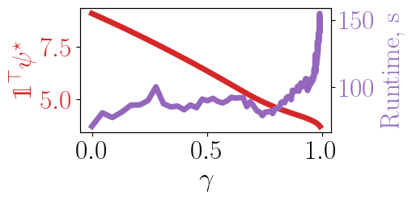
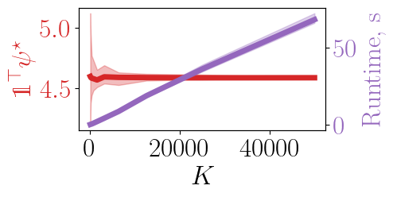

# Risk-Sensitive Hosting Capacity

Solar hosting capacity analysis (HCA) assesses the ability of a distribution network to host distributed solar generation without seriously violating distribution network constraints. 
RSHC is a set of algorithms for solving two risk-sensitive solar hosting capacity analysis problems: the question of maximizing aggregate installed solar capacities, subject to risk constraints, and an incremental algorithm to assess the acceptability of solar installation configurations.

1. Optimality - Evaluating the maximum hosting capacity.
2. Acceptability - Determination whether a specified capacity remains within limits.

## Installation

RSHC uses the [Bazel](https://bazel.build/) build system, which handles all dependencies. Additionally, a [MOSEK](https://www.mosek.com/) license must be installed. In order to use the [Gurobi](https://www.gurobi.com/) solvers, you must install [Gurobi](https://www.gurobi.com/downloads/) and point the `GUROBI_HOME` environment variable to its path.

## Optimality

This evaluates the maximum hosting capacity of a grid with specified parameters. The code can be run by using the command:
```
bazel run //:optimality [--config=gurobi] [--config=no_fs] -- [options]
```
The `gurobi` config option is required to use the Gurobi solvers. The `no_fs` option is included to remove any dependence on the `<filesystem>` header, which is not included with all `gcc` implementations. The available options that can be applied are listed below.

| Option | Description |
| ------ | ----------- |
| n, network | MATPOWER network case file |
| d, der | DER installation file |
| l, load | File containing load scenarios |
| p, pv | File containing PV generation scenarios |
| v, nu | CVaR parameter for voltage limit |
| g, gamma | CVaR parameter for line flow capacity limit |
| k, scenarios | Number of scenarios to consider |
| r, randomize | Randomize the list of scenarios |
| u, unit | Convert the line parameters to per-unit |
| t, tolerance | Solver tolerance (only for MOSEK) |
| z, scale | Objective function scaling parameter |
| b, verbose | Output solver progress and save data to file |

An example of the optimality code for a 3-bus network for various risk-parameters, and the effect of changing the number of scenarios on solution quality are shown below.



## Acceptability

This is an iterative approach to evaluate whether or not hosting capacities are within acceptable levels of infeasibility. This can be run using the command:
```
bazel run //:acceptability [--config=gurobi] [--config=no_fs] -- [options]
```
The available options for the acceptability code are:

| Option | Description |
| ------ | ----------- |
| n, network | MATPOWER network case file |
| d, der | DER installation file |
| l, load | File containing load scenarios |
| p, pv | File containing PV generation scenarios |
| v, nu | CVaR parameter for voltage limit |
| g, gamma | CVaR parameter for line flow capacity limit |
| k, scenarios | Number of scenarios to consider |
| u, unit | Convert the line parameters to per-unit |
| f, file | File containing DER capacities to evaluate |

An example of the acceptability test on a 3-bus power network is shown below. The evaluated points are shown with open circles, while the solid circles represent points that were identified as unacceptable without solving feasibility explicitly. This demonstrates the efficiency of this approach to solve the acceptability problem.

https://user-images.githubusercontent.com/4148233/163688222-7af3af99-1379-4558-9328-42ef44cd560b.mp4

## References
In using this work, we ask that you cite the following paper.

<a id="1">[1]</a> A.N. Madavan, N. Dahlin, S. Bose (2022). "Conditional Value at Risk-Sensitive Solar Hosting Capacity in Distribution Networks"
